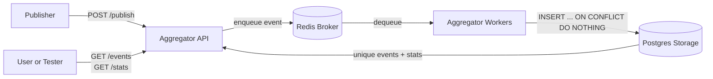

# Pub-Sub Log Aggregator Terdistribusi

Sistem ini mengimplementasikan log aggregator multi-service dengan FastAPI, Redis, dan Postgres. Fokus utamanya adalah idempotent consumer, deduplication persisten, transaksi, dan kontrol konkurensi.

## Arsitektur

- `aggregator`: API HTTP dan worker consumer internal.
- `publisher`: simulator event yang mengirim duplikasi terkontrol.
- `broker`: Redis internal sebagai queue.
- `storage`: Postgres 16 dengan named volume `pg_data`.

Dedup dilakukan di tabel `processed_events` dengan unique constraint `(topic, event_id)`. Worker menjalankan transaksi `READ COMMITTED` dan `INSERT ... ON CONFLICT DO NOTHING`, lalu menaikkan counter statistik di transaksi yang sama.



## Menjalankan

```bash
docker compose up --build
```

Aggregator tersedia di:

```text
http://localhost:8080
```

Menjalankan publisher demo 20.000 event dengan 30% duplikasi:

```bash
docker compose --profile demo up --build publisher
```

## API

Publish single event:

```bash
curl -X POST http://localhost:8080/publish \
  -H 'Content-Type: application/json' \
  -d '{"topic":"app.logs","event_id":"e-1","timestamp":"2026-06-18T10:00:00Z","source":"manual","payload":{"message":"hello"}}'
```

Publish batch:

```bash
curl -X POST http://localhost:8080/publish \
  -H 'Content-Type: application/json' \
  -d '{"events":[{"topic":"app.logs","event_id":"e-2","timestamp":"2026-06-18T10:00:01Z","source":"manual","payload":{"message":"a"}},{"topic":"app.logs","event_id":"e-2","timestamp":"2026-06-18T10:00:02Z","source":"manual","payload":{"message":"duplicate"}}]}'
```

Melihat event unik dan statistik:

```bash
curl http://localhost:8080/events
curl 'http://localhost:8080/events?topic=app.logs'
curl http://localhost:8080/stats
```

## Tests

Install dependency dev lalu jalankan:

```bash
pip install -r aggregator/requirements.txt -r requirements-dev.txt
pytest
```

Test mencakup validasi skema, dedup, filter topic, stats, worker paralel, counter concurrency, health endpoint, dan stress kecil.

Hasil verifikasi saat ini:

- `pytest`: 15 test lulus.
- `docker compose up -d`: stack berhasil start.
- `docker compose --profile demo up --build publisher`: publisher berhasil mengirim `20.000` event dan exit code `0`.

## Metrik Eksperimen

Pengujian performa pada `2026-06-19` menghasilkan:

- Total event dari publisher: `20.000`
- Duplikasi terkonfigurasi: `30%`
- Total batch request: `80`
- Waktu total publish: `1,82 detik`
- Throughput publish: sekitar `10.989 event/detik`
- Rata-rata latensi per batch: sekitar `22,75 ms`
- Hasil dedup run publisher: `14.000 unique_processed` dan `6.000 duplicate_dropped`

## Bukti Persistensi

Data Postgres disimpan di named volume `pg_data`. Untuk demo:

1. Jalankan `docker compose up --build`.
2. Publish event dan cek `/events` serta `/stats`.
3. Recreate container: `docker compose down` lalu `docker compose up`.
4. Publish ulang event dengan `(topic, event_id)` yang sama.
5. Cek bahwa event tidak bertambah dan `duplicate_dropped` naik.

Jangan gunakan `docker compose down -v` saat membuktikan persistensi karena opsi itu menghapus named volume.

Bukti eksperimen aktual pada `2026-06-19`:

1. Event sentinel dipublish dengan `topic=persistence.check` dan `event_id=persist-2026-06-19`.
2. Sebelum recreate, `/stats` menunjukkan `received=20004`, `unique_processed=14003`, `duplicate_dropped=6001`.
3. Stack direcreate dengan `docker compose down` lalu `docker compose up -d`, tanpa `-v`.
4. Event sentinel yang sama dipublish ulang.
5. Sesudah recreate, `/stats` menjadi `received=20005`, `unique_processed=14003`, `duplicate_dropped=6002`.

Interpretasinya: event lama tetap tersimpan dan publish ulang setelah recreate dianggap duplicate, bukan unique baru.

## Video Demo

Link video: `TODO: isi dengan link YouTube unlisted/public`.

Checklist video:

- Build image dan menjalankan Compose.
- Arsitektur multi-service dan jaringan lokal.
- Publish event unik dan duplikat.
- Bukti idempotency dari `/events` dan `/stats`.
- Worker paralel untuk transaksi/konkurensi.
- Recreate container tanpa menghapus volume.
- Publisher demo 20.000 event dengan minimal 30% duplikasi.
- Logging dan metrik.
