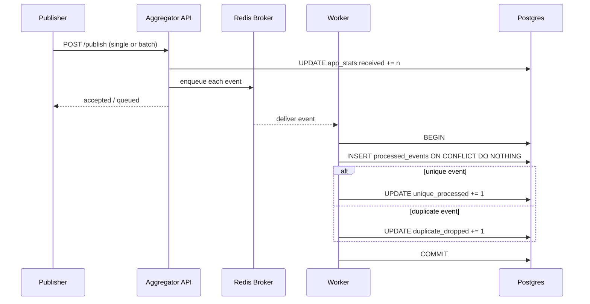

# Laporan UAS Sistem Terdistribusi

## Ringkasan Sistem

Sistem yang dibangun adalah Pub-Sub log aggregator berbasis Docker Compose dengan empat komponen utama: `publisher`, `aggregator`, `broker` Redis, dan `storage` Postgres. `publisher` menghasilkan event dengan proporsi duplikasi terkontrol, `aggregator` menyediakan endpoint HTTP untuk publish dan query, Redis dipakai sebagai queue internal untuk memisahkan penerimaan event dari pemrosesan, dan Postgres menjadi dedup store persisten. Fokus rancangan ada pada idempotent consumer, deduplication kuat berbasis unique constraint, dan transaksi yang aman di bawah konkurensi multi-worker. Setiap event diproses dengan pola `INSERT ... ON CONFLICT DO NOTHING` pada pasangan `(topic, event_id)`, lalu statistik diperbarui secara atomik di transaksi yang sama. Dengan pendekatan ini, delivery dapat tetap at-least-once, tetapi state akhir di storage tetap konsisten. Implementasi dijalankan sepenuhnya pada jaringan lokal Compose, memakai named volume agar data tetap bertahan setelah container di-recreate.

Referensi utama: Coulouris, G., Dollimore, J., Kindberg, T., & Blair, G. (2012). *Distributed systems: Concepts and design* (5th ed.). Addison-Wesley.

## T1 - Karakteristik Sistem Terdistribusi

Sistem ini memperlihatkan karakteristik inti sistem terdistribusi karena komponen berjalan di proses dan container berbeda, berkomunikasi melalui jaringan, dan harus tetap benar walaupun masing-masing komponen dapat gagal secara independen. Pada desain Pub-Sub log aggregator, `publisher` tidak menyimpan data langsung ke Postgres, tetapi mengirim event ke `aggregator`, lalu event diteruskan ke broker internal untuk diproses asynchronous oleh beberapa worker. Trade-off utama dari desain ini adalah meningkatnya decoupling dan skalabilitas, tetapi konsekuensinya adalah konsistensi menjadi tidak bisa diasumsikan instan. Event dapat tiba terlambat, duplikat, atau diproses paralel oleh worker yang berbeda. Karena itu, correctness dipindahkan dari jaringan ke lapisan storage dengan dedup store persisten. Pendekatan ini sejalan dengan pandangan bahwa sistem terdistribusi harus mengelola concurrency, partial failure, dan ketiadaan global clock yang sempurna. Dengan kata lain, desain yang baik bukan mencoba menghilangkan ketidakpastian jaringan, melainkan membatasi dampaknya melalui identitas event, transaksi atomik, dan observability yang memadai untuk mendeteksi state sistem (Coulouris et al., 2012).

## T2 - Publish-Subscribe vs Client-Server

Arsitektur publish-subscribe lebih tepat dipilih ketika producer dan consumer tidak perlu terikat secara ketat pada waktu eksekusi yang sama. Pada log aggregator, publisher seharusnya tetap dapat menyerahkan event walaupun penyimpanan akhir atau worker sedang sibuk. Jika pola client-server langsung dipakai, producer akan lebih bergantung pada availability dan performa komponen downstream. Sebaliknya, dengan publish-subscribe, pengiriman dan pemrosesan dipisahkan: `POST /publish` menerima event, mencatat bahwa event telah diterima, lalu worker memproses queue secara asynchronous. Model ini mempermudah scaling karena jumlah worker dapat ditambah tanpa mengubah publisher. Ia juga lebih cocok untuk burst traffic, seperti saat ribuan log dikirim dalam waktu singkat. Namun publish-subscribe membawa konsekuensi: urutan global sulit dijamin, observability harus lebih baik, dan exactly-once delivery tidak realistis tanpa biaya kompleksitas yang tinggi. Untuk tugas ini, trade-off tersebut dapat diterima karena tujuan utamanya adalah konsistensi state akhir, bukan respons sinkron dari setiap event. Karena itu, publish-subscribe secara teknis lebih sesuai dibanding client-server langsung (Coulouris et al., 2012).

## T3 - At-Least-Once vs Exactly-Once Delivery

At-least-once delivery menjamin pesan tidak hilang selama mekanisme retry masih berjalan, tetapi konsekuensinya pesan yang sama dapat diterima lebih dari sekali. Exactly-once delivery terdengar ideal, namun dalam sistem terdistribusi ia sulit dicapai secara penuh karena kegagalan bisa terjadi di titik yang ambigu: side effect mungkin sudah berhasil, tetapi acknowledgment tidak sempat terkirim. Dalam kondisi seperti itu, pengirim cenderung mengulang pesan, sehingga consumer harus mampu menerima duplikasi tanpa merusak state. Sistem ini secara sadar memilih model at-least-once. `publisher` memang sengaja membuat duplikasi, Redis dapat menyajikan pesan ulang bila alur pengolahan perlu diulang, dan worker memproses event dengan pola idempotent write. Jaminan correctness tidak diletakkan pada transport, melainkan pada tabel `processed_events` dengan unique constraint `(topic, event_id)`. Jika event yang sama datang lagi, insert kedua tidak menghasilkan row baru dan efek samping logisnya menjadi nol. Dari sudut pandang storage, hasil akhirnya menyerupai exactly-once processing, meskipun delivery fisik tetap at-least-once. Ini adalah kompromi praktis yang umum dipakai pada sistem event-driven modern (Coulouris et al., 2012).

## T4 - Penamaan Topic dan Event ID

Skema penamaan pada sistem ini dirancang untuk mendukung deduplication, query, dan isolasi domain. `topic` dipakai sebagai namespace log, misalnya `app.logs`, `audit.logs`, atau `persistence.check`, sehingga event dapat dikelompokkan menurut fungsi atau sumber logisnya. `event_id` berperan sebagai identitas unik event pada scope topic tertentu. Dedup tidak menggunakan `event_id` saja, tetapi pasangan `(topic, event_id)`, karena dua topic berbeda bisa saja memiliki `event_id` yang sama tanpa konflik makna. Contohnya, `manual-1` pada `app.logs` dan `audit.logs` harus dianggap sebagai dua event berbeda. Strategi ini membuat aturan dedup lebih tepat dan menghindari false positive. Dari sisi implementasi, `topic`, `event_id`, dan `source` divalidasi agar tidak kosong, sedangkan `timestamp` wajib bertimezone supaya event lebih mudah diurutkan dan diaudit. Untuk publisher otomatis, event ID dibuat collision-resistant menggunakan UUID. Pendekatan ini konsisten dengan prinsip naming dalam sistem terdistribusi: identifier harus cukup stabil, cukup unik, dan punya ruang semantik yang jelas agar proses berbeda dapat merujuk entitas yang sama secara konsisten (Coulouris et al., 2012).

## T5 - Ordering Praktis

Sistem tidak menerapkan total ordering global karena kebutuhan utama log aggregator adalah penyimpanan unik dan observasi, bukan serialisasi absolut semua event lintas publisher. Ordering praktis dilakukan dengan dua lapisan. Pertama, setiap event membawa `timestamp` ISO8601 yang harus memiliki timezone. Kedua, saat event dibaca dari database, hasil diurutkan berdasarkan `event_timestamp` lalu `id` auto-increment sebagai tie-breaker. Strategi ini cukup baik untuk kebutuhan audit operasional karena pengguna masih dapat melihat urutan yang masuk akal per topic. Namun desain ini juga mengakui batasannya. Clock antar producer dapat drift, sehingga timestamp bukan bukti kausalitas mutlak. Dua event dari sumber berbeda juga bisa memiliki waktu yang sangat berdekatan atau bahkan tertukar secara observasional. Jika kebutuhan berubah menjadi causal ordering atau total ordering, sistem perlu menambah logical clock atau monotonic counter per source. Dengan demikian, keputusan saat ini bukan kekurangan, tetapi trade-off yang disengaja: kompleksitas ordering tidak dinaikkan melampaui kebutuhan domain, selama konsistensi dedup dan keterbacaan log tetap terjaga (Coulouris et al., 2012).

## T6 - Failure Modes dan Mitigasi

Failure mode utama dalam sistem ini adalah duplikasi event, crash worker saat memproses queue, restart container, dependency yang belum siap saat startup, dan race condition antar worker. Duplikasi ditangani oleh dedup store persisten di Postgres, sehingga event yang sama tidak menambah data baru. Race condition dimitigasi lewat unique constraint dan transaksi database, bukan hanya logika aplikasi. Startup dependency dikelola dengan healthcheck pada Redis dan Postgres, serta `depends_on` berbasis status sehat di Docker Compose. Worker sendiri menjalankan loop yang melakukan logging dan retry sederhana ketika terjadi exception, sehingga kegagalan sesaat tidak langsung mematikan seluruh service. Untuk crash atau recreate container, named volume menjaga data Postgres tetap tersedia, dan eksperimen persistensi menunjukkan bahwa event sentinel yang dipublish sebelum recreate masih ada setelah stack dihidupkan ulang. Saat event yang sama dikirim lagi, `unique_processed` tidak berubah, sedangkan `duplicate_dropped` bertambah satu. Hal ini menunjukkan bahwa crash recovery pada lapisan dedup benar-benar bekerja. Secara desain, mitigasi diarahkan pada durable state dan pemulihan yang deterministik, bukan mengandalkan jaringan atau worker yang selalu sempurna (Coulouris et al., 2012).

## T7 - Eventual Consistency

Sistem ini bersifat eventually consistent karena penerimaan event melalui `POST /publish` dipisahkan dari penyimpanan unik ke database. Ketika API menerima event, counter `received` langsung bertambah dan event dimasukkan ke queue Redis. Setelah itu, worker memproses event secara asynchronous. Artinya, ada jendela waktu ketika event sudah diterima tetapi belum terlihat pada `GET /events`. Dalam konteks log aggregator, model ini dapat diterima karena tujuan utamanya adalah menahan burst traffic dan menjaga API tetap responsif. Idempotency dan deduplication menjadi komponen penting agar eventual state tetap benar. Walaupun event yang sama masuk beberapa kali atau diproses hampir bersamaan, state akhir tetap hanya menyimpan satu record unik per `(topic, event_id)`. Statistik `unique_processed` dan `duplicate_dropped` kemudian merefleksikan hasil akhir pemrosesan, bukan sekadar penerimaan. Dengan demikian, konsistensi akhir yang diperoleh adalah konsistensi berbasis convergent state: setelah queue habis diproses dan tidak ada kegagalan baru, seluruh replika logis dari state aplikasi mengarah pada hasil yang sama. Ini sesuai dengan karakter eventual consistency pada sistem asynchronous dan message-driven (Coulouris et al., 2012).

## T8 - Desain Transaksi

Transaksi inti pada sistem ini terjadi ketika worker memproses satu event dari queue. Di dalam satu transaksi Postgres dengan isolation `READ COMMITTED`, worker mencoba melakukan `INSERT` ke `processed_events` dengan `ON CONFLICT DO NOTHING`. Bila insert berhasil, event dianggap unik; bila tidak, event dianggap duplikat. Dalam transaksi yang sama, aplikasi menaikkan counter statistik yang relevan, yaitu `unique_processed` atau `duplicate_dropped`. Pola ini penting karena atomicity harus mencakup dua hal sekaligus: keberhasilan penyimpanan event dan perubahan statistik. Jika keduanya dipisah di luar transaksi, sistem bisa menghasilkan angka yang menyesatkan saat crash terjadi di tengah proses. Consistency dijamin oleh unique constraint dan tipe data yang jelas. Isolation `READ COMMITTED` dipilih karena aplikasi tidak mengandalkan pola read-then-write yang rentan race, melainkan menyerahkan konflik pada constraint database. Durability diperoleh dari Postgres dan named volume. Lost-update pada statistik juga dihindari dengan `UPDATE ... SET value = value + 1`, bukan membaca nilai di aplikasi lalu menulis ulang. Desain ini memenuhi prinsip ACID dengan biaya kompleksitas yang masih rasional untuk tugas ini (Coulouris et al., 2012).

## T9 - Kontrol Konkurensi

Kontrol konkurensi dalam sistem ini mengandalkan kombinasi multi-worker, transaksi database, unique constraint, dan atomic counter update. Worker dapat berjalan paralel, sehingga dua atau lebih worker bisa saja mencoba memproses event identik pada waktu hampir bersamaan. Jika aplikasi hanya memeriksa “apakah event sudah ada?” lalu melakukan insert terpisah, maka race condition tetap mungkin terjadi. Karena itu, desain yang dipilih tidak memakai pengecekan pre-read seperti itu. Keputusan akhir diserahkan ke database melalui unique constraint `(topic, event_id)` dan `ON CONFLICT DO NOTHING`. Hanya satu transaksi yang dapat membuat row unik baru; transaksi lain yang datang sesudahnya otomatis jatuh ke jalur duplicate. Pendekatan ini lebih kuat daripada lock manual di level aplikasi karena serialisasi kritis terjadi di komponen yang memang mengelola konkurensi data. Test lokal juga membuktikan perilaku ini: seratus konsumsi paralel terhadap event identik menghasilkan tepat satu unique processing dan sembilan puluh sembilan duplicate drop. Dengan demikian, concurrency control yang diterapkan bukan sekadar teori, tetapi terbukti menjaga integritas data dan mencegah double-process di bawah beban paralel (Coulouris et al., 2012).

## T10 - Orkestrasi, Keamanan, Persistensi, Observability

Docker Compose mengorkestrasi seluruh layanan pada jaringan lokal internal. Hanya service `aggregator` yang diekspos ke host melalui port `8080`, sedangkan Redis dan Postgres tetap internal dan tidak dibuka ke luar. Dari perspektif keamanan, ini mengurangi attack surface dan memenuhi batasan tugas yang melarang penggunaan layanan eksternal publik. Persistensi dijaga oleh named volume `pg_data` untuk Postgres dan `broker_data` untuk Redis, sehingga state penting tidak hilang saat container dihapus dan dibuat ulang. Orkestrasi startup dibantu healthcheck pada Redis dan Postgres, sehingga `aggregator` baru berjalan setelah dependency siap. Dari sisi observability, sistem menyediakan endpoint `/health`, `/events`, dan `/stats`, serta log worker yang membedakan event `processed` dan `duplicate_dropped`. Dokumentasi juga menjelaskan cara build, run, test, dan bukti persistensi. Dengan gabungan orkestrasi yang sederhana namun eksplisit, isolasi jaringan, penyimpanan persisten, dan endpoint observability, sistem ini memenuhi kebutuhan operasional dasar dari sebuah layanan terdistribusi kecil yang harus tetap mudah didemonstrasikan dan diaudit (Coulouris et al., 2012).

## Metrik dan Uji

Pengujian otomatis menghasilkan `15` test lulus menggunakan `pytest`. Cakupannya meliputi validasi schema event, publish single dan batch, deduplication, filter topic, konsistensi `GET /stats` dan `GET /events`, race condition multi-worker, konsistensi counter di bawah eksekusi paralel, serta stress kecil berbasis batch.

Pengujian performa dijalankan pada `2026-06-19` dengan service `publisher` melalui Docker Compose profile `demo`. Publisher mengirim `20.000` event dalam `80` batch berukuran `250`, dengan proporsi duplikasi `30%`. Waktu total pengiriman tercatat `1,82` detik, sehingga throughput publish berada di kisaran `10.989 event/detik`. Dilihat dari sisi batch request, rata-rata latensi per batch sekitar `22,75 ms`. Dari hasil statistik sistem, run publisher tersebut menyumbang `20.000 received`, `14.000 unique_processed`, dan `6.000 duplicate_dropped`, sehingga duplicate rate aktual tepat `30%`. Angka ini konsisten dengan konfigurasi publisher dan menunjukkan bahwa deduplication berjalan benar di bawah beban yang memenuhi syarat minimum tugas.

Uji persistensi juga dijalankan pada `2026-06-19` menggunakan event sentinel `("persistence.check", "persist-2026-06-19")`. Sebelum recreate stack, statistik menunjukkan `received=20004`, `unique_processed=14003`, dan `duplicate_dropped=6001`. Setelah `docker compose down` tanpa `-v`, stack dihidupkan kembali dan event sentinel yang sama dikirim ulang. Hasilnya `unique_processed` tetap `14003`, sedangkan `duplicate_dropped` naik menjadi `6002`. Event lama juga tetap terlihat di `GET /events?topic=persistence.check`. Ini membuktikan bahwa named volume Postgres benar-benar menjaga dedup state setelah recreate container.

## Link Video

https://youtu.be/DUxejspBjjU

## Daftar Pustaka

Coulouris, G., Dollimore, J., Kindberg, T., & Blair, G. (2012). *Distributed systems: Concepts and design* (5th ed.). Addison-Wesley.
